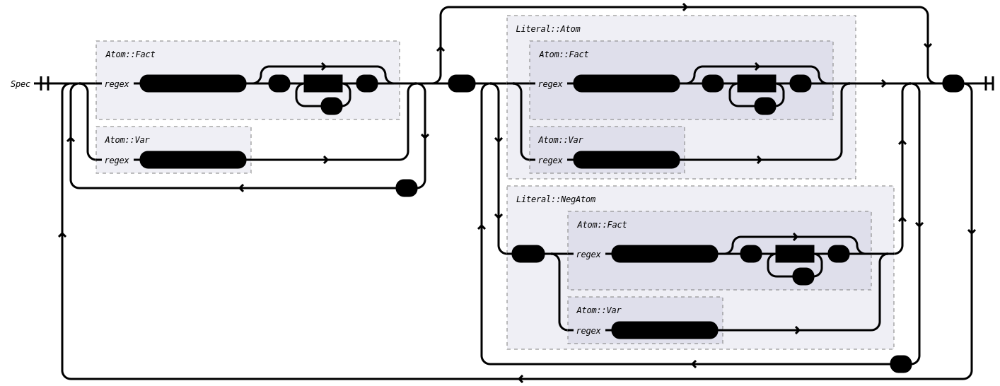

# datalog-rs: Datalog with negation
This crate implements a simple Datalog dialect that supports negation-as-failure, $Datalog^\neg$.

The specific semantics of this language are discussed below. This language is used in JustAct-framework paper [\[1\]](#references) as a simple example policy language.


## Semantics
$Datalog^\neg$ has a very simple semantics.

### Rules
The language consists of a set of _logical rules_ that assign truth values to atoms. Simply put, every rule is an implication, where one or more _consequents_ are derived as true if zero or more _antecedents_ hold. As usual, the antecedents are considered conjunct, i.e., _all_ of them have to hold in order to derive the consequents.

For example:
```datalog
foo :- bar.            // Derives 'foo' if 'bar' is true.
foo, bar :- baz, quz   // Derives 'foo' AND 'bar' if 'baz' AND 'quz' are true.
foo.                   // Always derives 'foo'.
```

Note that the rules themselves are disjunct, i.e., only on of the rules above has to hold to derive `foo`.

### Atom arity
Atoms can have other atoms as arguments in order to specify relations between objects. They can be arbitrarily nested.

For example:
```datalog
foo(bar).         // OK, atom 'foo' with arity 1 has constant 'bar' as argument (arity 0)
foo(bar(baz)).    // OK, atom `foo` with arity 1 has atom `bar` with arity 1 as argument (which, in turn, has constant `baz` as argument (arity 0))
foo(bar, baz).    // OK, atom 'foo' has arity 2
```

### Negation
Even though $Datalog^\neg$ is said to support negation, it only does so as failure, i.e., when some atom is _not_ derived as true. As such, some antecedents (but only antecedents) may be negative, implying that the consequent should only be derived as true if that antecedent is _not_ derived as true.

Note that this means that falsity _cannot_ be derived; it can only occur as a failure of deriving truth.

This implementation of $Datalog^\neg$ uses the alternating fixed-point semantics [\[3\]](#references) to compute a program's denotation, meaning that contradictory logical rules (e.g., `foo :- not foo`) will result in `foo` being **unknown** instead of being assigned a true- or false value.

For example:
```datalog
foo :- not bar.        // Only derives 'foo' if 'bar' was _not_ derived.
not foo.               // Illegal; only antecedents can be negative.
foo :- not foo.        // 'foo' will become 'unknown'
```

### Variables
Finally, $Datalog^\neg$ supports the usage of _variables_ to quantify over the knowledge base. For example:
```datalog
foo(a).
bar(X) :- foo(X).      // Will shadow every `foo(...)` with a `bar(...)`
```

Not every usage of variables is supported, though. Specifically, rules must satisfy the _safety property:_
> Every variable is bound by positive antecedents

In other words, no variable can occur unless it also occurs in a positive antecedent. This property exists because we use the knowledge base to quantify over; hence, if a variable only occurs as consequent or in a negative antecedent, it isn't clear what the universe of atoms to quantify over would entail (it would be infinite with symbols of arbitary shape).

For example:
```datalog
foo(X) :- X.          // OK, `X` is a positive antecedent
foo :- bar(X).        // OK, `X` occurs within a positive antecedent
X :- foo.             // Illegal; `X` does not occur as a positive antecedent
foo :- not bar(X).    // Illegal; `X` does not occur as a positive antecedent
```


## Syntax
The following represents the concrete syntax of $Datalog^\neg$ as a railroad diagram.




## Features
This crate supports the following features:
- `interpreter`: Enables the `alternating_fixpoint`-functions to allow derivation for the $Datalog^\neg$-programs using the alternating fixpoint semantics[\[3\]](#references).
- `ir`: Enables the intermediate representation of Datalog, which is a simpler version of the main AST and which is generic over the kind of atoms used.
- `log`: Enables `log`-traces during the derivation process for debugging purposes.
- `macros`: Enables the `datalog!()`- and `datalog_trans!()`-macros for writing $Datalog^\neg$-programs as a Rust embedded DSL.
- `parser`: Enables a parser that can parse $Datalog^\neg$-programs from source text.
- `railroad`: Enables implementations of `ToNode` and associated traits from the [`ast-toolkit-railroad`](https://github.com/Lut99/ast-toolkit-rs) for AST nodes. This allows railroad diagrams to be generated (see the [`railroad.rs`](./examples/railroad.rs)).
- `transitions`: Enables a layer on top of $Datalog^\neg$ to model [eFLINT](https://gitlab.com/eflint)-like transitions on top of the normal specification.


## CLI
This repository also features a CLI for running Datalog files from a binary. To use it, run:
```sh
cargo run --example interpreter --features interpreter,log,parser -- <file1> <file2> ...
```

The interpreter will print the denotation of all input files appended to each other, in order.


## Contribution
Contributions to this crate are welcome! If you have any suggestions, fixes or ideas, please feel free to [leave an issue](/Lut99/datalog-rs/issues) or [create a pull request](/Lut99/datalog-rs/pulls).


## License
This project is licensed under Apache 2.0. See [LICENSE](./LICENSE) for more details.


## References
\[1\] Esterhuyse, C.A., Müller, T., van Binsbergen, L.T. (2024). _JustAct: Actions Universally Justified by Partial Dynamic Policies._ In: Castiglioni, V., Francalanza, A. (eds) Formal Techniques for Distributed Objects, Components, and Systems. FORTE 2024. Lecture Notes in Computer Science, vol 14678. Springer, Cham. <https://doi.org/10.1007/978-3-031-62645-6_4>

\[2\] Esterhuyse, C.A., Müller, T., van Binsbergen, L.T. (2025). _JustAct+: Justified and Accountable Actions in Policy-Regulated, Multi-Domain Data Processing._ Extended version of \[1\]. In: arXiv <https://arxiv.org/abs/2502.00138>

\[3\] A. Van Gelder. 1989. _The alternating fixpoint of logic programs with negation._ In Proceedings of the eighth ACM SIGACT-SIGMOD-SIGART symposium on Principles of database systems (PODS '89). Association for Computing Machinery, New York, NY, USA, 1–10. <https://doi.org/10.1145/73721.73722>
